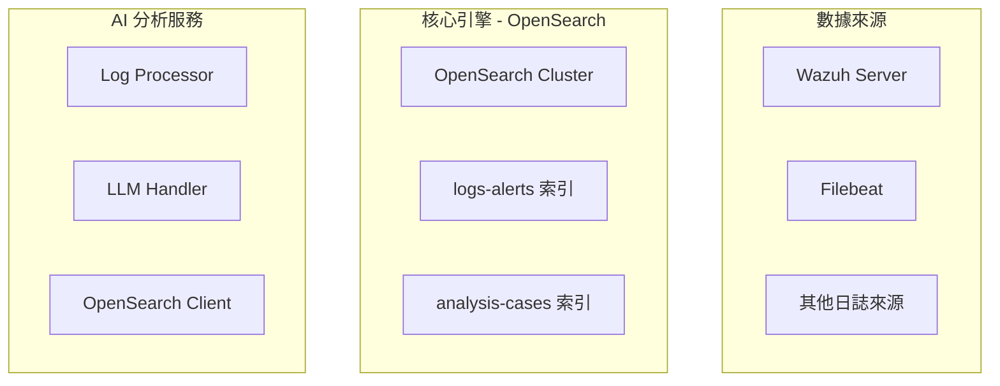

# LMS Log Analyzer - OpenSearch 架構版本

本專案是一個基於 AI 的日誌分析系統，使用 OpenSearch 作為中央資料儲存與搜尋引擎，結合 LLM（Gemini）進行智慧分析。

## 架構概覽



## 主要特點

1. **雙索引架構**：
   - `logs-alerts`：儲存所有日誌與分析結果，支援全文檢索
   - `analysis-cases`：儲存高品質分析案例，支援 k-NN 向量搜尋

2. **智慧分析**：
   - 使用 Gemini LLM 進行日誌分析
   - 基於歷史案例的相似度搜尋，提供更準確的分析

3. **彈性運行模式**：
   - 檔案模式：相容舊版，從本地檔案讀取日誌
   - OpenSearch 模式：從 OpenSearch 持續處理日誌

## 安裝步驟

### 1. 安裝 Python 依賴

```bash
pip install -r requirements.txt
```

### 2. 部署 OpenSearch

使用 Docker Compose 快速部署：

```yaml
version: '3'
services:
  opensearch:
    image: opensearchproject/opensearch:latest
    environment:
      - discovery.type=single-node
      - plugins.security.disabled=true
      - OPENSEARCH_JAVA_OPTS=-Xms512m -Xmx512m
    ports:
      - 9200:9200
      - 9600:9600
    volumes:
      - opensearch-data:/usr/share/opensearch/data
      
  opensearch-dashboards:
    image: opensearchproject/opensearch-dashboards:latest
    ports:
      - 5601:5601
    environment:
      - OPENSEARCH_HOSTS=http://opensearch:9200
      - DISABLE_SECURITY_DASHBOARDS_PLUGIN=true
      
volumes:
  opensearch-data:
```

### 3. 配置環境變數

建立 `.env` 檔案：

```bash
# OpenSearch 設定
OPENSEARCH_HOST=localhost
OPENSEARCH_PORT=9200
OPENSEARCH_USER=admin
OPENSEARCH_PASSWORD=admin
OPENSEARCH_SSL=false
OPENSEARCH_VERIFY_CERTS=false

# Gemini API
GEMINI_API_KEY=your-api-key-here

# 索引名稱
OPENSEARCH_LOGS_INDEX=logs-alerts
OPENSEARCH_CASES_INDEX=analysis-cases

# 分析設定
VECTOR_SEARCH_K=5
CASE_QUALITY_THRESHOLD=0.8
LOG_FETCH_INTERVAL=60
```

## 使用方法

### 1. 檔案模式（傳統模式）

從本地檔案讀取並分析日誌：

```bash
python -m lms_log_analyzer.main --mode file
```

### 2. OpenSearch 模式（單次執行）

從 OpenSearch 讀取未分析的日誌並處理：

```bash
python -m lms_log_analyzer.main --mode opensearch
```

### 3. OpenSearch 模式（持續執行）

持續監控並處理新日誌：

```bash
python -m lms_log_analyzer.main --mode opensearch --continuous
```

### 4. 查看統計資訊

```bash
python -m lms_log_analyzer.main --stats
```

## 資料流程

1. **日誌注入**：Wazuh/Filebeat 將日誌發送到 OpenSearch 的 `logs-alerts` 索引
2. **日誌處理**：Log Processor 定期從 OpenSearch 拉取未分析的日誌
3. **相似度搜尋**：使用 k-NN 從 `analysis-cases` 索引查詢相似案例
4. **LLM 分析**：將日誌與相似案例一起送交 Gemini 進行分析
5. **結果儲存**：
   - 更新 `logs-alerts` 索引中的分析結果
   - 高品質案例寫入 `analysis-cases` 索引供未來參考

## API 範例

### 直接寫入日誌到 OpenSearch

```python
from lms_log_analyzer.src.opensearch_client import get_opensearch_client

client = get_opensearch_client()

# 寫入單筆日誌
log_data = {
    "raw_log": "Failed login attempt from 192.168.1.100",
    "log_source": "ssh",
    "timestamp": "2024-01-01T12:00:00Z"
}
log_id = client.index_log(log_data)

# 批量寫入
logs = [
    {"raw_log": "log1", "log_source": "app1"},
    {"raw_log": "log2", "log_source": "app2"}
]
success_count = client.bulk_index_logs(logs)
```

### 搜尋相似案例

```python
similar_cases = client.search_similar_cases(
    "SQL injection attempt detected",
    k=5,
    min_score=0.7
)
```

## 監控與視覺化

使用 OpenSearch Dashboards（預設 http://localhost:5601）可以：

1. 建立即時儀表板監控攻擊趨勢
2. 查詢特定類型的安全事件
3. 追蹤分析成本與效能指標
4. 視覺化地理位置攻擊分佈

## 效能優化建議

1. **索引優化**：
   - 定期清理舊日誌（例如保留 30 天）
   - 使用索引生命週期管理（ILM）

2. **向量搜尋優化**：
   - 調整 `ef_construction` 和 `m` 參數以平衡速度與準確性
   - 考慮使用 GPU 加速的嵌入模型

3. **批次處理**：
   - 調整 `OPENSEARCH_BATCH_SIZE` 以優化處理效率
   - 使用 `LOG_FETCH_INTERVAL` 控制處理頻率

## 故障排除

### OpenSearch 連線問題

```bash
# 檢查 OpenSearch 是否正常運行
curl -X GET "localhost:9200/_cluster/health?pretty"
```

### 索引初始化問題

如果索引建立失敗，可手動建立：

```bash
# 刪除舊索引（如果存在）
curl -X DELETE "localhost:9200/logs-alerts"
curl -X DELETE "localhost:9200/analysis-cases"

# 重新執行程式，會自動建立索引
python -m lms_log_analyzer.main --mode opensearch
```

## 貢獻指南

歡迎提交 Issue 和 Pull Request！

## 授權

MIT License 